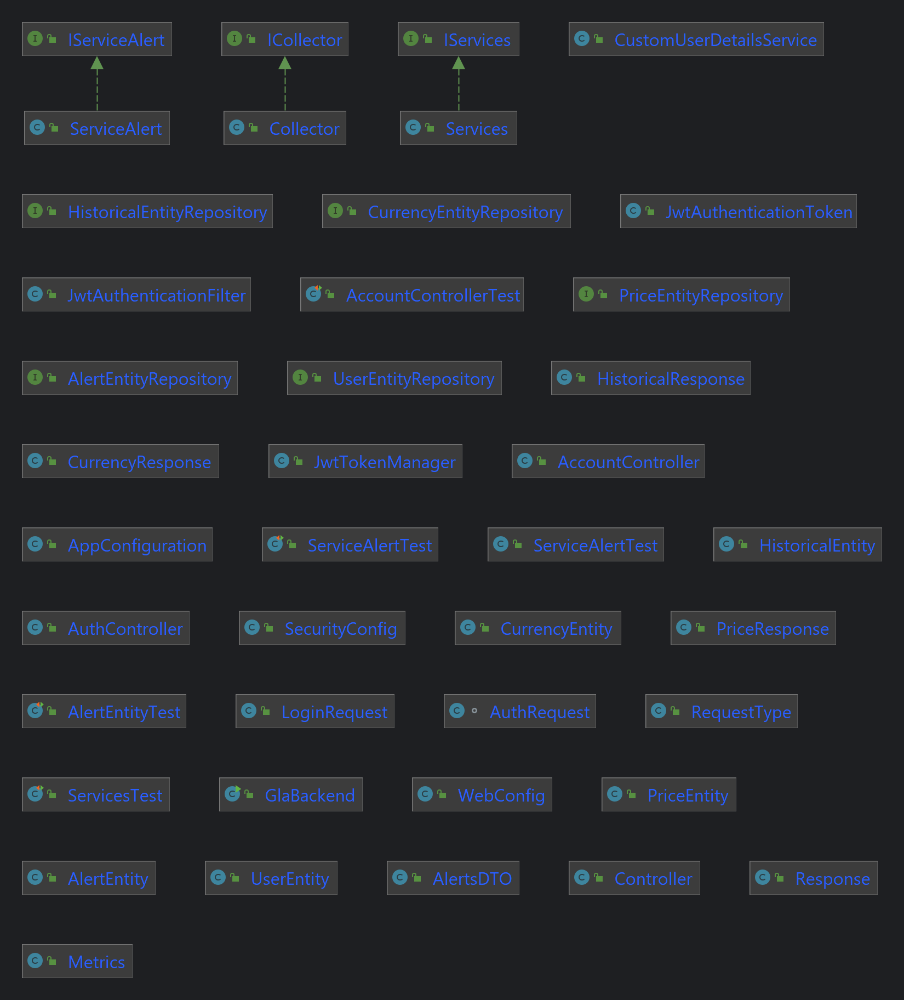
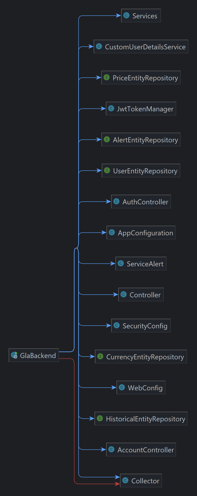

# Application de Surveillance des Marchés de Cryptomonnaies
## Tiago SILVEIRA FEITOSA
### Master Informatique - Ingénierie du Logiciel de la Société Numérique
M1 ILSEN CLASSIQUE
### Université d'Avignon et Pays du Vaucluse

#
#
#

# Application GLA
Cliquez ici pour le Rapport du Projet : [Rapport](rapport.md)

## Fonctionnalités

    Application Console ( Backend - SpringBoot ) :
        Collecte périodique de données sur les cryptomonnaies à partir d'API publiques (par ex. CoinCap).
        Stockage des données pertinentes (prix, volumes d'échange, indicateurs) dans une base de données.
        Fonctionnement en permanence.

    Application Web ( Frontend - Angular ) :
        Visualisations interactives des données (graphiques, courbes, chandeliers, heatmaps).
        Alertes personnalisées (seuils de prix, variations, indicateurs techniques).
        Prévisions basées sur des algorithmes simples (moyennes mobiles, régressions linéaires).
        Notifications par email.

    
## Documentation Utilisateur

Pour démarrer le système sur localhost

### Prérequis du système

Système Ubuntu latest

Assurez-vous de faire une mise à jour des repositories de linux avant de commencer :

    sudo apt update

Java Development Kit (JDK)

Version : 17 Amazon Corretto 

Pour installer jdk17:

    wget -O - https://apt.corretto.aws/corretto.key | sudo apt-key add -
    echo 'deb https://apt.corretto.aws stable main' | sudo tee /etc/apt/sources.list.d/corretto.list
    sudo apt-get update; sudo apt-get install -y java-17-amazon-corretto-jdk

Apache Maven v3.9.9

Utilisation : création de projet et gestion des dépendances

Pour installer :
    
    sudo apt install maven -y

Docker

Utilisation : conteneuriser l'application

    sudo apt install docker-ce -y

### Installation de la base de données

MariaDB latest

Utilisation : Base de données

Pour installer :

    sudo apt install mariadb-server mariadb-client -y

Pour démarrer la base de données : 

    sudo systemctl start mariadb

Créez vos identifiants et connectez-vous: 

    mysql -u root -p

Créez une nouvelle base de donnée nommée coincap :

    CREATE DATABASE coincap;

Assurez-vous que votre base de données est opérationnelle et que l'application peut s'y connecter avant de l'étape
prochaine.

### Installation du serveur SpringBoot

Clonez le dépôt localement avec :

    git clone https://github.com/tiagofdev/ApplicationGLA.git

Déplacez-vous ensuite dans le dossier nouvellement créé.

    cd ApplicationGLA

Créez des variables d'environnement des credentials de votre BD.
    
    export SPRING_DATASOURCE_URL=jdbc:mariadb://localhost:3306/coincap
    export SPRING_DATASOURCE_USERNAME=root
    export SPRING_DATASOURCE_PASSWORD=<your_password>

Créez l'exécutable et téléchargez tous les dépendances nécessaires :

    mvn clean install

Éxecutez l'application avec : 

    mvn spring-boot:run

### Installation de l'appli frontend Angular

Node.js et npm

Version : node v22.11

Pour installer node:

    curl -fsSL https://deb.nodesource.com/setup_22.x | sudo -E bash -
    sudo apt install -y nodejs

Angular

Version : v19

    npm install -g @angular/cli

Clonez le dépôt localement avec :

    git clone https://github.com/tiagofdev/angularGLA.git

Déplacez-vous ensuite dans le dossier nouvellement créé.

    cd GLAfrontend

Installez les dépendances :

    npm install

Démarrez l'application :
    
    ng serve

### Pour démarrer le système dans les conteneurs :

Déplacez-vous sur le dossier de ApplicationGLA où vous trouverez le fichier docker-compose.yml

    cd ApplicationGLA

Créez et démarrez le réseau de conteneurs avec :
    
    docker-compose up --build

Docker devrait automatiquement créer et démarrer l'exécution de trois conteneurs.

## Documentation Technique

### Architecture du Système :

#### Frontend (Angular) :

Components : représente chaque vue/état de l'application.

Controllers : gère la récupération des données, la logique métier et se connecte au backend via HTTP ou WebSocket.

Routeur : gère la navigation entre les différentes parties de l'application.

#### Backend (Spring Boot) :

Controllers : gèrent les requêtes HTTP et fournissent des réponses au frontend.

Services : contiennent la logique métier et interagissent avec les référentiels.

Repositories : interface avec la base de données (JPA, Hibernate).

Sécurité : assure l'authentification et l'autorisation à l'aide de Spring Security.

Base de données MariaDB :

Stocke les données utilisées par l'application.

Interagit avec les repositories via des frameworks JPA.

Surveillance (Prometheus et Grafana) :

### Documentation de l'API

#### GET /getPrices

Description : récupère les derniers prix des actifs disponibles.

Paramètres de la requête : Aucun

Format de la réponse : JSON

Exemple de réponse :

    {
        "prices": [
            { "name": "Bitcoin", "priceUsd": "42000", "collectedAt": "2025-01-15 20:06:36.910488" },
            { "name": "Ethereum", "priceUsd": "3200", "collectedAt": "2025-01-15 19:42:36.942939" }
        ]
    }

#### GET /getCurrency

Description : récupère les taux de change actuels pour les devises prises en charge.

Paramètres de la requête : Aucun

Format de la réponse : JSON

Exemple de réponse :

    {
        "currencies": [
            { "name": "Bitcoin", "rank": "1", "explorer": "https://blockchain.info/", "symbol": "BTC" },
            { "name": "Ethereum", "rank": "2", "explorer": "https://etherscan.io/", "symbol": "ETH" } 
        ]
    }

#### GET /getProjectionsLR/{currency}

Description : fournit des projections de régression linéaire pour la devise donnée.

Paramètre de chemin : devise (par exemple, USD, EUR)

Format de réponse : JSON

Exemple de requête:

    GET /getProjectionsLR/Bitcoin

Exemple de requête :
    
    {
        [ 106671.92, 107087.78, 107503.63, … ]
    }

#### POST /register

Description : enregistre un nouveau compte utilisateur.

Format de la requête : JSON

Corps de la requête (Request Body):

    {
        "username": "newuser@example.com",
        "password": "securepassword",
    }

Example Response :

    {
        "message": "Success - New Account Created",
        "userId": "newuser@example.com"
    }

## Architecture de l'algorithme 

    
## Structure du Système

### Docker
    
    Backend SpringBoot         :8080   image: jelastic/springboot
    Frontend Angular           :4200   image: dynatrace/easytravel-angular-frontend
    Base de données MariaDB    :3306   image: mariadb

## Structure de la base de données

### MariaDB [coincap]> describe currency_entity;
    +----------+--------------+------+-----+---------+-------+
    | Field    | Type         | Null | Key | Default | Extra |
    +----------+--------------+------+-----+---------+-------+
    | id       | varchar(255) | NO   | PRI | NULL    |       |
    | explorer | varchar(255) | YES  |     | NULL    |       |
    | icon     | varchar(255) | YES  |     | NULL    |       |
    | name     | varchar(255) | NO   |     | NULL    |       |
    | rank     | int(11)      | NO   |     | NULL    |       |
    | symbol   | varchar(255) | YES  |     | NULL    |       |
    +----------+--------------+------+-----+---------+-------+

### MariaDB [coincap]> describe historical_entity;
    +----------------+---------------+------+-----+---------+----------------+
    | Field          | Type          | Null | Key | Default | Extra          |
    +----------------+---------------+------+-----+---------+----------------+
    | id             | bigint(20)    | NO   | PRI | NULL    | auto_increment |
    | supply         | decimal(38,2) | YES  |     | NULL    |                |
    | close_price    | decimal(38,2) | YES  |     | NULL    |                |
    | date           | date          | NO   |     | NULL    |                |
    | high_price     | decimal(38,2) | YES  |     | NULL    |                |
    | low_price      | decimal(38,2) | YES  |     | NULL    |                |
    | name           | varchar(255)  | NO   | MUL | NULL    |                |
    | open_price     | decimal(38,2) | YES  |     | NULL    |                |
    | volume_usd24hr | decimal(38,2) | YES  |     | NULL    |                |
    +----------------+---------------+------+-----+---------+----------------+

### MariaDB [coincap]> describe price_entity;
    +--------------+---------------+------+-----+---------+----------------+
    | Field        | Type          | Null | Key | Default | Extra          |
    +--------------+---------------+------+-----+---------+----------------+
    | id           | bigint(20)    | NO   | PRI | NULL    | auto_increment |
    | collected_at | datetime(6)   | YES  |     | NULL    |                |
    | name         | varchar(255)  | YES  |     | NULL    |                |
    | price_usd    | decimal(38,2) | YES  |     | NULL    |                |
    +--------------+---------------+------+-----+---------+----------------+
