# Application de Surveillance des Marchés de Cryptomonnaies
## Tiago SILVEIRA FEITOSA
### Master Informatique - Ingénierie du Logiciel de la Société Numérique
M1 ILSEN CLASSIQUE
### Université d'Avignon et Pays du Vaucluse

#
#
#

 

# Application GLA - Rapport du projet
Cliquez ici pour la documentation technique et d'utilisateur : [Documentation](README.md)

## Objectifs

    Application Console ( Backend - SpringBoot ) :
        Collecte périodique de données sur les cryptomonnaies à partir d'API publiques (par ex. CoinCap).
        Stockage des données pertinentes (prix, volumes d'échange, indicateurs) dans une base de données.
        Fonctionnement en permanence.

    Application Web ( Frontend - Angular ) :
        Visualisations interactives des données (graphiques, courbes, chandeliers, heatmaps).
        Alertes personnalisées (seuils de prix, variations, indicateurs techniques).
        Prévisions basées sur des algorithmes simples (moyennes mobiles, régressions linéaires).
        Notifications par email.

    Pratiques de Développement :
        Méthodologies agiles (scrum/kanban).
        Tests avancés (unitaires / mocks, implementation, performances, sécurité, couverture).
        Déploiement via DevOps (CI/CD, Docker, Kubernetes).

## Outils utilisés

    Conteneur :                 Docker, docker-compose
    Base de données :           MariaDB               
    Tests Unitaires :           Mockito, JUnit      
    Tests de Couverture :       Jacoco, SonarQube
    Tests de Sécurité :         Owasp Zap           
    Tests de Performance :      JMeter
    Tests de Style de codage :  Checkstyle
    Monitoring :                Prometheus
    Graphes du Monitoring :     Grafana         
    Suivi Qualité :             SonarQube
    Suivi de Projet :           Jira
    Control de Version :        GitHub
    Integration Continue :      GitHub Actions
    IDE :                       IntelliJ

## Suivi de Projet
Configuration de l'appli jira sur github pour automatiser le backlog lors des commits.

J'ai essayé d'utiliser un format sur les commit pour automatiser la mise a jour du Jira.

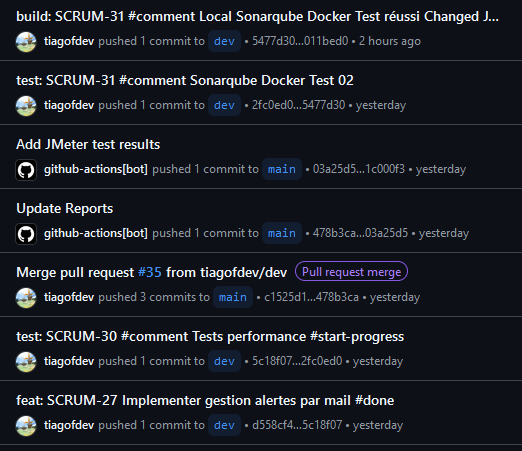

#### Backlog sur Jira :

    SCRUM-19: Créer un backend SpringBoot
    SCRUM-17: Intégrer l'API publique (CoinCap)
    SCRUM-18: Créer un script pour collecter périodiquement les données
    SCRUM-20: Créer une base de données relationnelle MariaDB
    SCRUM-21: Intégrer le backend pour sauvegarder les données sur la BD
    SCRUM-24: Développer une API backend pour fournir les données au frontend
    SCRUM-14: Configurer Docker et Kubernetes (Minikube)
    SCRUM-25: Créer une interface utilisateur intuitive avec Angular
    SCRUM-26: Intégrer des bibliothèques de visualisation (Chart.js, D3.js)
    SCRUM-41: Algorithmes de prévisions et leurs graphes
    SCRUM-27: Implémenter la gestion des alertes personnalisées et l'envoi d'emails
    SCRUM-39: Configurer un système de Login avec token
    SCRUM-29: Écrire des tests unitaires avec des mocks
    SCRUM-30: Effectuer des tests de charge et de performance pour les deux applications
    SCRUM-31: Scanner les vulnérabilités dans le code avec SonarQube
    SCRUM-33: Documentation Technique
    SCRUM-34: Documentation Utilisateur
    SCRUM-35: Rapport

Timeline :

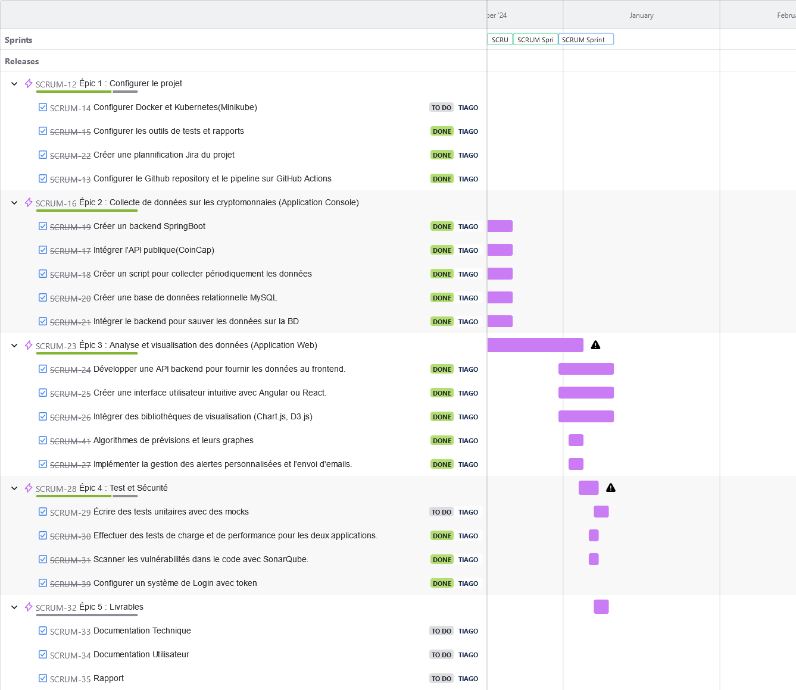

Suivi de Projet :

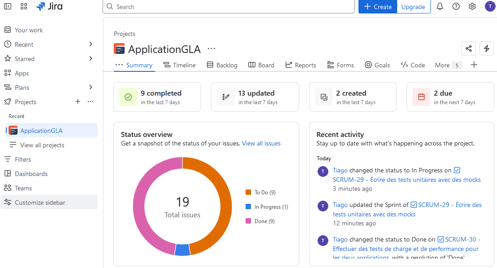

## Sprint 0

User Stories

    US1 : En tant que développeur, je souhaite démarrer une session de sprint et terminer les tâches dans les délais. 
        Criteres d'acceptation: 
        Lorsque je valide les dépôts GitHub, les tâches Jira sont marquées comme terminées
    US2 : En tant que développeur, lorsque je pousse de nouvelles fonctionnalités vers le référentiel, 
        le CI doit déclencher automatiquement toutes les étapes nécessaires pour tester le code.
    US3 : En tant que développeur, je souhaite idéalement écrire des tests le plus tôt possible pour guider le processus 
        de développement et améliorer la qualité du code

Objectifs du Sprint :

    Objectif 1 : Plannifier le projet
    Objectif 2 : Créer une plannification Jira du projet
    Objectif 3 : Configurer les outils de tests et rapports
    Objectif 4 : Configurer Docker et Kubernetes(Minikube)
    Objectif 5 : Configurer le Github repository et le pipeline sur GitHub Actions

Tâches Completes :

    [SCRUM-12]  Plannifier le projet
    [SCRUM-22]  Créer une plannification Jira du projet
    [SCRUM-13]  Configurer le Github repository et le pipeline sur GitHub Actions

Tâches pas terminées :

    [SCRUM-14]  Configurer Docker et Kubernetes(Minikube)
    [SCRUM-15]  Configurer les outils de tests et rapports

## Sprint 1

User Stories

    US1 : En tant que système, je veux collecter périodiquement des données sur les cryptomonnaies afin de les stocker dans une base de données.
        Critères d'acceptation :
            Les données incluent prix, volumes d'échange et indicateurs clés.
            Les données sont collectées toutes les 60 secondes.
            En cas d'erreur d'API, un mécanisme de reprise est présent.

    US2 : En tant que système, je veux stocker les données collectées dans une base de données relationnelle pour permettre leur traitement ultérieur.
        Critères d'acceptation :
            La base de données supporte un stockage durable et indexé.
            Les données collectées sont bien formatées et normalisées.

Objectifs du Sprint :

    Objectif 1: Créer un backend SpringBoot 
    Objectif 2: Intégrer l'API publique (CoinCap)
    Objectif 3: Créer un script pour collecter périodiquement les données
    Objectif 4: Créer une base de données relationnelle MariaDB
    Objectif 5: Intégrer le backend pour sauvegarder les données sur la BD
    Objectif 6: Développer une API backend pour fournir les données au frontend

Tâches terminées :

    [SCRUM-19]: [Créer un backend SpringBoot]
    [SCRUM-17]: [Intégrer l'API publique (CoinCap)]
    [SCRUM-18]: [Créer un script pour collecter périodiquement les données]
    [SCRUM-20]: [Créer une base de données relationnelle MariaDB]
    [SCRUM-21]: [Intégrer le backend pour sauvegarder les données sur la BD]

Tâches pas terminées :

    [SCRUM-24]: [Développer une API backend pour fournir les données au frontend]

## Sprint 2

User Stories

    US3 : En tant qu'utilisateur, je veux visualiser les données des cryptomonnaies sous forme de graphiques interactifs pour mieux comprendre les tendances du marché.
        Critères d'acceptation :
            Les graphiques incluent courbes de prix, chandeliers et heatmaps.
            Interface intuitive avec navigation entre différentes cryptomonnaies.

Objectifs du sprint :

    Objectif 1: Créer une interface utilisateur intuitive avec Angular
* Historique
    * Naviguer entre différentes cryptomonnaies,
    * Sélectionner des plages de temps spécifiques
        * Dernière Heure
        * 24 Heures
        * 1 Semaine
        * 1 Mois
        * 1 An
    * Sélectionner des graphiques différents
        * Courbe
        * Bars
        * Chandeliers

    Objectif 2: [Intégrer des bibliothèques de visualisation (Chart.js, D3.js)]
* Afficher des courbes de prix,
* des graphiques en chandeliers
* des graphiques de bars

Tâches terminées :

    [SCRUM-25]: Créer une interface utilisateur intuitive avec Angular
    [SCRUM-26]: Intégrer des bibliothèques de visualisation D3.js

## Sprint 3

User Stories

    US4 : En tant qu'utilisateur, je veux accéder à des prévisions basées sur des algorithmes simples pour anticiper les tendances du marché.
    Critères d'acceptation :
      Les prévisions utilisent des moyennes mobiles et des régressions linéaires.
      Les marges d'erreur des modèles sont affichées.

Objectifs du sprint :

    Objectif 1: Créer des algorithmes pour calculer des projections sur le backend
* Prévisions
    * Moyennes Mobiles
    * Régressions Linéaires
    * Limites des marges d'erreur

    Objectif 2: Montrer les projections sur le frontend sur en forme de graphes D3.js

Tâches en cours :

    [SCRUM-41] Algorithmes de prévision et leurs graphes

## Sprint 4

User Stories

    US5 : En tant qu'utilisateur, je veux configurer des alertes personnalisées basées sur des seuils pour être informé 
      des variations importantes.
    Critères d'acceptation :
      L'utilisateur peut définir des seuils de prix, variations ou indicateurs.
      Les notifications sont envoyées par email.

Objectifs du sprint :

    Objectif 1: Créer un système de monitoring des prix sur backend
    Objectif 2: Sauvegarder des configurations de chaque utilisateur sur quels currencies et leurs criteria d'alertes
* Alertes
    * Seuils de Prix
    * Variations de Pourcentage

Tâches completes :

    [SCRUM-27] Implémenter la gestion des alertes personnalisées et l'envoi d'emails

## Sprint 5

User Stories

    US6 : Configurer un système de Login avec token En tant que développeur, je veux configurer un système de login avec 
      token afin de sécuriser l'accès à l'application.

Objectifs du sprint :

    Objectif 1 : Configurer un système de Login avec token
Tâches Terminées

    [SCRUM-39] Configurer un système de Login avec token

## Sprint 6
User Stories

    US7 : En tant que développeur, je veux effectuer des tests de charge et de performance pour les deux applications 
      afin de m'assurer qu'elles peuvent supporter de nombreuses requêtes et utilisateurs simultanés. je veux scanner 
      les vulnérabilités dans le code avec SonarQube afin d'identifier et corriger les faiblesses de sécurité.

Objectifs du sprint :

    Objectif 1: Configurer JMeter sur le CI pipeline
    Objectif 2: Configurer et évaluer des tests de couvrage sur Sonarqube

Tâches terminées :

    SCRUM-30: Effectuer des tests de charge et de performance pour les deux applications
    SCRUM-31: Scanner les vulnérabilités dans le code avec SonarQube

## Sprint 7
    US7 : En tant que développeur, je veux écrire des tests unitaires avec des mocks pour assurer que chaque composant 
      de l'application fonctionne comme prévu.

Objectifs du sprint :

    Objectif 1: Écrire des tests unitaires et d'intégration

Tâches en cours :
[SCRUM-29]

## Calendrier d'activités

* 20/11/24
    - Initier Rapport du projet
    - Planifier le projet sur Jira
* 09/12/24
    - Tester l'API de coincap
* 15/12/24
    - Configurations: Pipeline, Dockerfile, pom.xml
    - Créer un backend Springboot
    - Système de collect sur l'API coincap
    - Configurer la BD sur le backend
* 19/12/24
    - Page de Login et Page de Création de Compte
    - Échoué - Configuration de login et maintenance de tokens
    - Endpoints pour Login
* 25/12/24
    - Création du template du tableau de bord (dashboard)
    - Implémentation de la première option de graphique : Courbe
    - Création de différentes entités pour différents ensembles de données
    - Mise à jour du système JPA pour mettre à jour les entrées dans la base de données
    - Création de différentes méthodes pour collecter des données à partir de l'API
    - Mise à jour des endpoints pour les données principales sur client et serveur
* 27/12/24
    - Implementation des graphiques bars et chandeliers
* 28/12/24
    - Configuration du Pipeline
    - Checkstyle, Jacoco, Javadocs
* 29/12/24
    - JMeter
* 30/12/24
    - Interface, Correction de bugs sur le frontend
    - Ajout d'un graphique depuis plus d'un mois
    - Démarrage des projections
* 31/12/24
    - Projections
* 01/01/25
    - Système de Login et Création de Compte
    - Système de Token
    - Sécurité des endpoints avec filtres
* 02/01/25
    - Versioning automatique configuration dans le pipeline
* 05/01/25
    - Système d'alertes par email
* 07/01/25
    - Changer JDK de 21 au 17
    - Implementer CI secondaire pour faire des tests sur Sonarqube docker
* 09/01/25
    - Configurer docker

## Intégration Continue

### GitHub Actions
Principales automatisations sur pull request

* java 17 sur Ubuntu
* Configurer MariaDB
* Versioning automatique
* mvn checkstyle tôt 
* mvn test : plugins
* mvn javadocs
* mvn verify a la fin
* garder les rapports sur la main
* Démarrer l'appli et le connecter a la DB
* Installer et executer JMeter
* garder JMeter rapports

### CI Locaux
* Sonarqube

Avec github hooks, j'ai ajouté une commande pour exécuter des tests sur SonarQube sur le conteneur local quand on 
détecte un push sur dev
    
    # .git/hooks/post-merge
    if [ "$(git rev-parse --abbrev-ref HEAD)" == "dev" ]; then
    echo "Push to dev detected, running tests and SonarQube analysis on local Docker container..."
    mvn clean verify sonar:sonar \
    -Dsonar.projectKey=cryptosurge \
    -Dsonar.projectName='cryptosurge' \
    -Dsonar.host.url=http://localhost:9000 \
    -Dsonar.token=sqp_152a67a920fba399c9d95e7c121995a1a89f160a
    fi

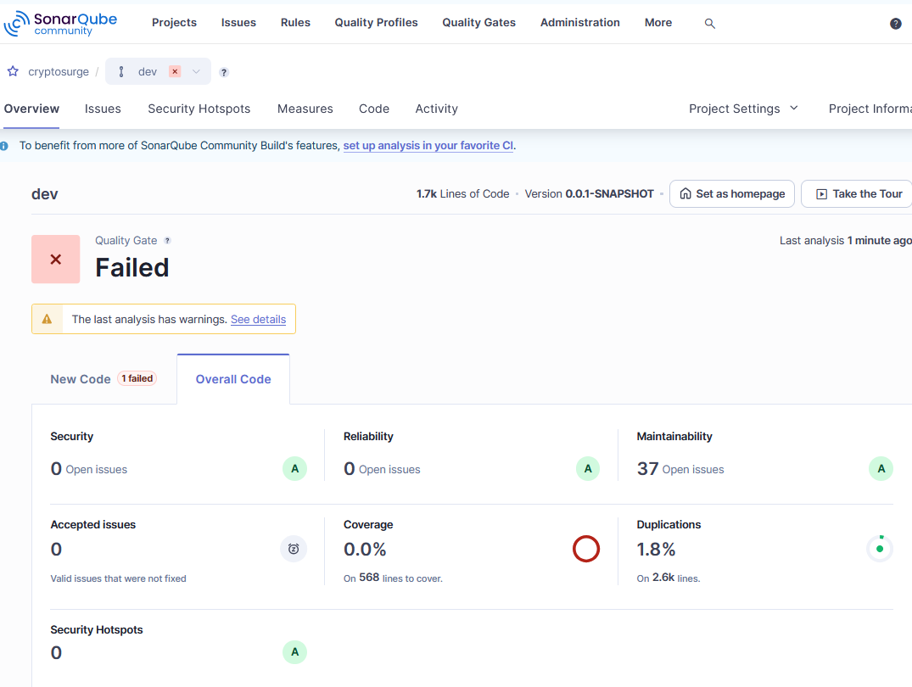

* Prometheus et Grafana

On a démarré un conteneur pour Prometheus et un autre pour Grafana. 

Sur le fichier prometheus.yml, la configuration scrape_interval : 15s : Cela définit l'intervalle par défaut pour la 
fréquence à laquelle Prometheus doit collecter des métriques des cibles : tous les 15s.

La configuration targets : ['host.docker.internal:8080']: Cela spécifie que Prometheus doit extraire des métriques de 
l'application fonctionnant sur host.docker.internal:8080

Malheureusement, le filtre de sécurité des endpoints du springboot n'a pas permis l'accès de prometheus au serveur.

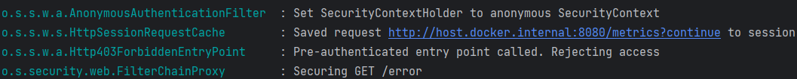

J'ai essayé d'ajouter une exception sur l'endpoint /actuator/** sur springboot, mais le problème a continué.

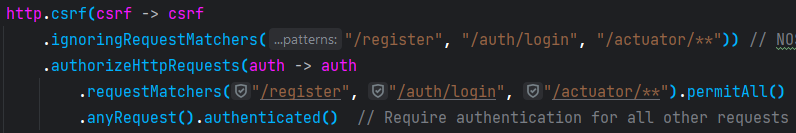

Le but serait de mesurer ces taux :
    * HTTP request rate
    * Average response time
    * CPU and memory usage
    * Database connection pool stats

## DevOps - Docker
Avec docker-compose, j'ai créé un réseau pour trois conteneurs differents, le backend, le frontend et la DB.
Le fichier docker-compose cherche le dockerfile de chaque projet pour construire l'image.
Pour le backend, on copie le fichier .jar et expose la porte 8080.
Le fichier .jar contient déjà toutes les dépendances nécessaires pour faire fonctionner l'appli springboot 
Pour le frontend, on copie le fichier package.json et expose la porte 4200.
Le fichier aussi installe angular engine sur le conteneur et les dépendances nécessaires pour démarrer l'appli Angular.

    Backend SpringBoot         :8080   image: springboot-gla
    Frontend Angular           :4200   image: node19
    Base de données MariaDB    :3306   image: mariadb:10.6
    Sonarqube                  :9000   image: sonarqube:community
    Prometheus                 :9090   image: prom/prometheus
    Grafana                    :3000   image: grafana/grafana

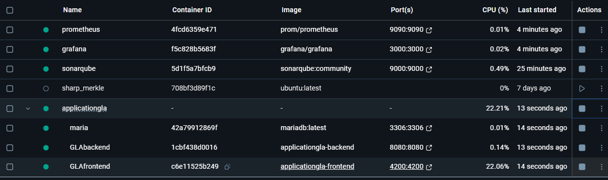

## Tests de performance

J'ai créé un plan de tests sur l'appli Apache JMeter configuration pour exécuter 20 threads sur la période de 40 
secondes pour faire des requetes sur l'endpoint /getPrices.

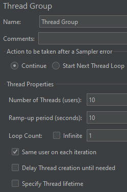

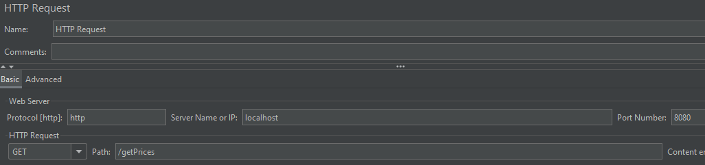

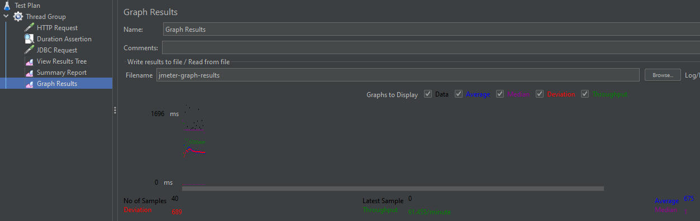

## Tests de Securité

Le plugin Owasp est exécuté dans le package des tests mvn et génère un rapport indiquant les vulnerabilités.

[dependency-check-report.html](target%2Fdependency-check-report.html)

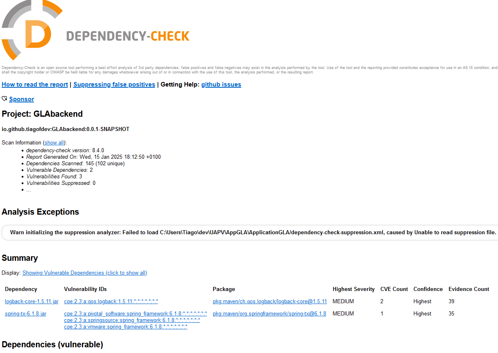

## Tests Unitaires

Mockito et JUnit 4

    